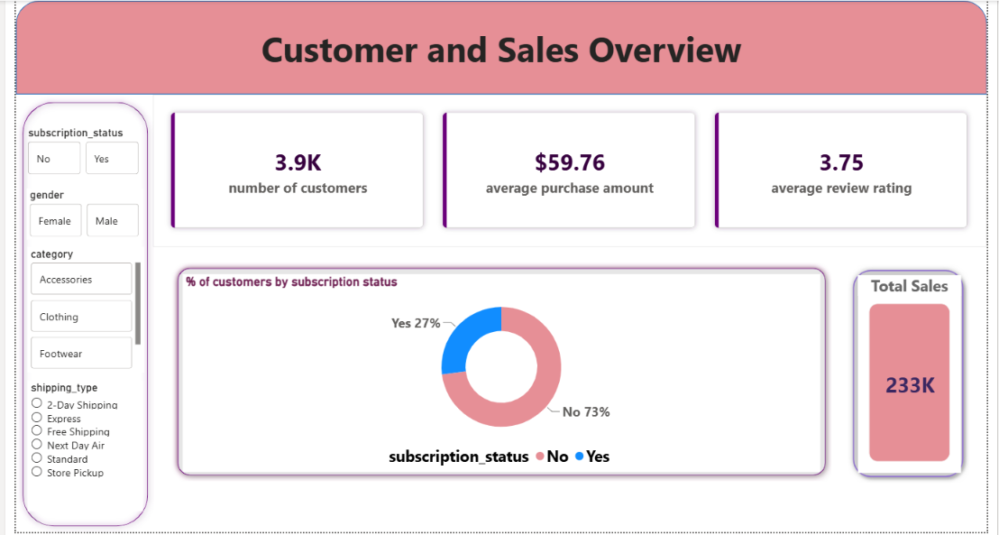
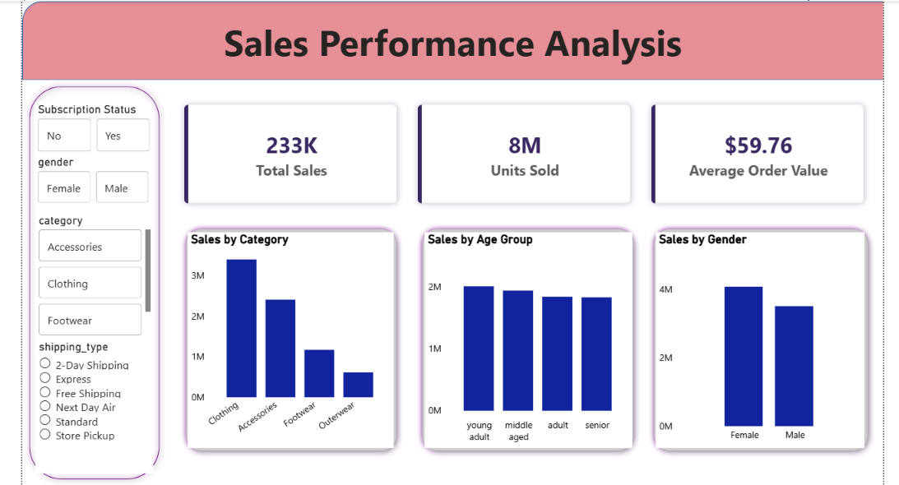
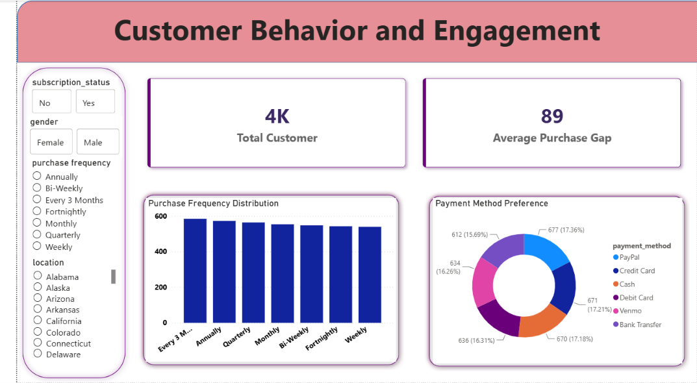

# Customer Behavior & Sales Analytics

> Understanding *who* buys, *why* they buy, and *what* drives repeat purchases — an end-to-end analysis of customer shopping behavior.
> Python for cleaning & EDA → PostgreSQL for business querying → Power BI for an interactive multi-page dashboard.

---

## Overview

This project walks through a complete data analytics workflow on a real customer shopping behavior dataset — from raw data to business-ready dashboards. The goal was to understand purchasing patterns, customer segments, and what drives revenue, then present those findings the way a business stakeholder would actually want to see them.

It's built to reflect real data analyst responsibilities: clean the data, ask sharp business questions, answer them with SQL, and visualize the story in Power BI.

---

## Dashboard Preview





---

##  Dataset

Customer Shopping Behavior Dataset (CSV) — structured transactional and customer-level data.

**Key columns:** `customer_id`, `age`, `age_group`, `gender`, `category`, `item_purchased`, `purchase_amount`, `purchase_frequency`, `subscription_status`, `payment_method`, `location`, `review_rating`

---

##  Tools & Technologies

| Stage | Tool |
|---|---|
| Data Loading & EDA | Python (Pandas, NumPy, Matplotlib, Seaborn) |
| Data Cleaning | Python (Pandas) |
| Business Querying | PostgreSQL (via pgAdmin) |
| Visualization | Power BI |
| Development | Jupyter Notebook |

---

##  Project Workflow

**1. Data Loading**
Loaded the dataset into Python with Pandas; verified schema, data types, and summary statistics.

**2. Exploratory Data Analysis (EDA)**
Analyzed customer demographics and purchasing behavior, identified trends in sales, subscription status, and payment methods, and visualized distributions and relationships.

**3. Data Cleaning**
Handled missing and inconsistent values, standardized column names/formats, and ensured correct data types across numerical and categorical fields.

**4. SQL Analysis (PostgreSQL)**
Imported the cleaned dataset into PostgreSQL and wrote queries to answer real business questions (see below).

**5. Power BI Dashboard**
Built a multi-page interactive dashboard with KPI cards, charts, and slicers for dynamic filtering.

---

##  Business Questions Answered (SQL)

All queries live in `Customer_Behavior_SQL_Queries.sql`:

1. What is the total revenue generated by male vs. female customers?
2. Which customers used a discount but still spent more than the average purchase amount?
3. Which are the top 5 products with the highest average review rating?
4. How does average purchase amount compare between Standard and Express shipping?
5. Do subscribed customers spend more? (Comparing average spend and total revenue: subscribers vs. non-subscribers.)
6. Which 5 products have the highest percentage of purchases with discounts applied?
7. What percentage of total revenue comes from discounted vs. non-discounted purchases?
8. How do customers segment into New, Returning, and Loyal based on total previous purchases — and how large is each segment?
9. What are the top 3 most purchased products within each category?
10. Are repeat buyers (5+ previous purchases) more likely to subscribe?
11. What is the revenue contribution of each age group?

---

##  Power BI Dashboard

A multi-page interactive dashboard covering:

- **Sales Overview** — high-level revenue and sales KPIs
- **Customer Demographics** — age, gender, and location breakdowns
- **Customer Behavior & Engagement** — subscription status, purchase frequency, payment method patterns

Built with KPI cards, charts, and slicers so a viewer can filter and drill into any segment dynamically.

---

##  Results & Insights

- Identified distinct **high-frequency and low-frequency customer segments**, useful for targeted retention strategies.
- Analyzed how **subscription status correlates with purchasing behavior**, surfacing differences between subscribers and non-subscribers.
- Highlighted **preferred payment methods and purchasing patterns** across the customer base.
- Segmented customers into **New, Returning, and Loyal** tiers based on purchase history — a foundation for lifecycle-based marketing decisions.

---

## How to Run This Project

**Python**
```bash
git clone https://github.com/janhavi1027/customer_behavior_analysis.git
cd customer_behavior_analysis
pip install pandas numpy matplotlib seaborn
```
Then open and run `Customer_Behavior_Analysis.ipynb` in Jupyter Notebook.

**PostgreSQL**
1. Create a database in PostgreSQL.
2. Import the cleaned dataset into a table.
3. Run the queries in `Customer_Behavior_SQL_Queries.sql` using pgAdmin or `psql`.

**Power BI**
1. Open `customer_behavior_dashboard.pbix` in Power BI Desktop (free).
2. Connect to the PostgreSQL database or the cleaned dataset.
3. Refresh the data to explore all dashboard pages interactively.

---

## Possible Extensions

- [ ] Publish the dashboard via Power BI's "Publish to Web" for a live, link-based demo
- [ ] Add a customer lifetime value (CLV) model on top of the segmentation
- [ ] Build a churn-prediction model using subscription and purchase-frequency features
- [ ] Automate the Python → PostgreSQL → Power BI refresh pipeline

---

## Conclusion

This project demonstrates a complete end-to-end data analysis pipeline — from raw data exploration and cleaning, through SQL-based business analysis, to interactive dashboard creation. Combining Python for preprocessing, PostgreSQL for structured querying, and Power BI for visualization, it surfaces real, decision-ready insights into customer behavior and sales patterns: purchasing frequency, subscription engagement, and payment preferences.

---

This project is licensed under the MIT License.
